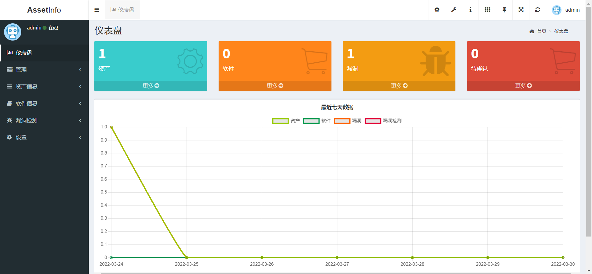

# AssetInfo

资产信息统计平台

## 描述

统计管理的资产及其所使用的软件、版本信息，录入漏洞信息，确认所用软件是否受该漏洞影响。

## 仪表盘

## 设置

修改仪表盘上的信息

### SmallBox

### LineBox

## 资产信息

先创建 `资产组` 和 `协议` (资产底层系统登录方式)

## 软件信息

先创建 `软件` （可对应多个版本）

资产和使用软件关联起来

## 漏洞检测

## 特别说明

`自动检测` 是在 `handlers\auto_check.go` 文件中简单处理，只做了如果存在就判定存在该漏洞，否则，判定该信息待处理。没有处理是否在某个范围内，如果需要处理，请自行修改。（一方面懒，一方面确实没想好该怎么处理。）

## 吐槽

`自动检测` 显示在独立表格最符合预期，但是本人实在没找到获取当前行 `id` 的方法。有大佬知道怎么搞得，欢迎提出~

**特别感谢**

本项目基于GoAdmin开发，在此感谢 [GoAdminGroup](https://github.com/GoAdminGroup) 开发组。

[GoAdmin](https://github.com/GoAdminGroup/go-admin)

[GoAdmin论坛](http://discuss.go-admin.com)

[GoAdmin文档](https://book.go-admin.cn)
