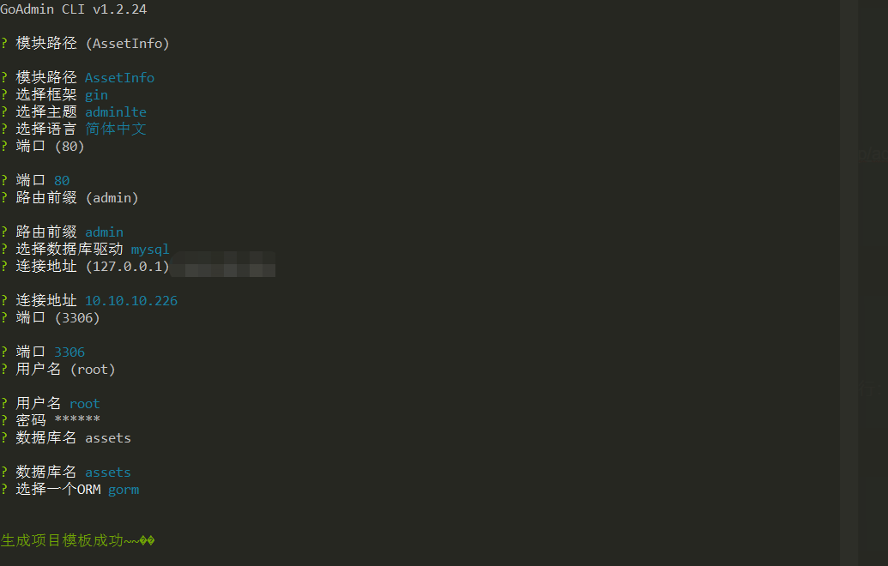
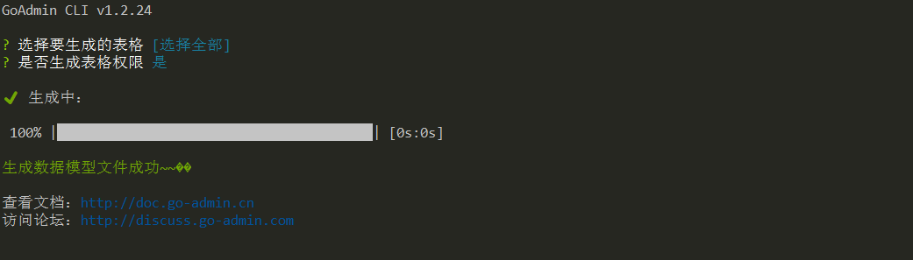

# 项目创建
## 导入数据库

```shell
# 下载数据库
wget https://gitee.com/go-admin/go-admin/raw/master/data/admin.sql

# 创建数据库
# CREATE DATABASE IF NOT EXISTS assets;
# 导入
mysql -h 127.0.0.1 -P 3306 -u root -p root assets < ./admin.sql
```

## 安装命令行工具

下载对应系统的二进制文件到本地，并配置到环境变量中。

地址：[http://doc.go-admin.cn/zh/install/](http://doc.go-admin.cn/zh/install/) 或 [https://github.com/GoAdminGroup/adm/releases](https://github.com/GoAdminGroup/adm/releases)

或使用命令安装：

```shell
go install github.com/GoAdminGroup/adm
```

## 初始化

首先新建一个项目文件夹，然后进入文件夹中使用最新版命令行工具 adm 执行：

```shell
adm init -l cn
```

或者使用以下命令，可以打开一个web界面安装：

```shell
adm init web -l cn
```



说明信息

```
1 安装初始化数据库：

- sqlite: https://gitee.com/go-admin/go-admin/raw/master/data/admin.db
- mssql: https://gitee.com/go-admin/go-admin/raw/master/data/admin.mssql
- postgresql: https://gitee.com/go-admin/go-admin/raw/master/data/admin.pgsql
- mysql: https://gitee.com/go-admin/go-admin/raw/master/data/admin.sql

2 执行以下命令运行：

> GO111MODULE=on go mod init AssetInfo
> GORPOXY=https://goproxy.io GO111MODULE=on go mod tidy
> GO111MODULE=on go run .

3 访问并登陆：

-  登陆：http://127.0.0.1/admin/login
账号：admin，密码：admin

-  生成CRUD模型：http://127.0.0.1:80/admin/info/generate/new

4 在README.md中查看更多

查看文档：http://doc.go-admin.cn
访问论坛：http://discuss.go-admin.com
```

### 代理配置

[GOPROXY](https://goproxy.io/zh/)

#### Bash (Linux or macOS)

```shell
# 配置 GOPROXY 环境变量
export GOPROXY=https://proxy.golang.com.cn,direct
# 还可以设置不走 proxy 的私有仓库或组，多个用逗号相隔（可选）
export GOPRIVATE=git.mycompany.com,github.com/my/private
```

#### PowerShell (Windows)

```shell
# 配置 GOPROXY 环境变量
$env:GOPROXY = "https://proxy.golang.com.cn,direct"
# 还可以设置不走 proxy 的私有仓库或组，多个用逗号相隔（可选）
$env:GOPRIVATE = "git.mycompany.com,github.com/my/private"
```

### 项目配置

```shell
go mod init AssetInfo
go mod tidy
```

## 添加数据模型

### 导入数据库

```shell
mysql -h 127.0.0.1 -P 3306 -u root -p root assets < ./assets.sql
```

### 生成数据模型

```shell
adm generate -l cn -c adm.ini
```


